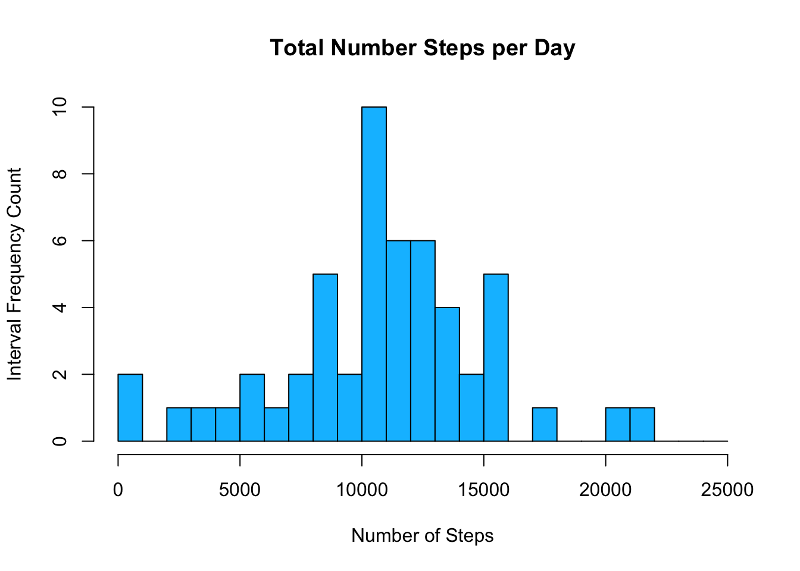
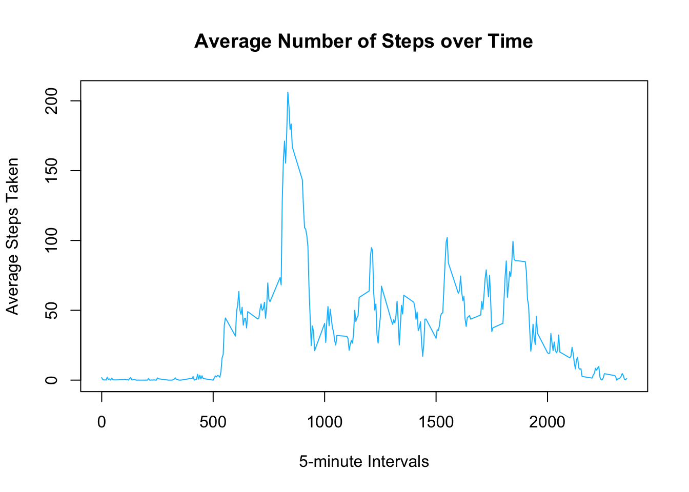
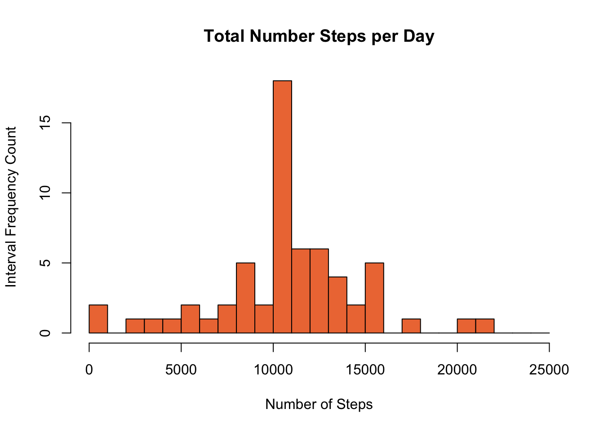
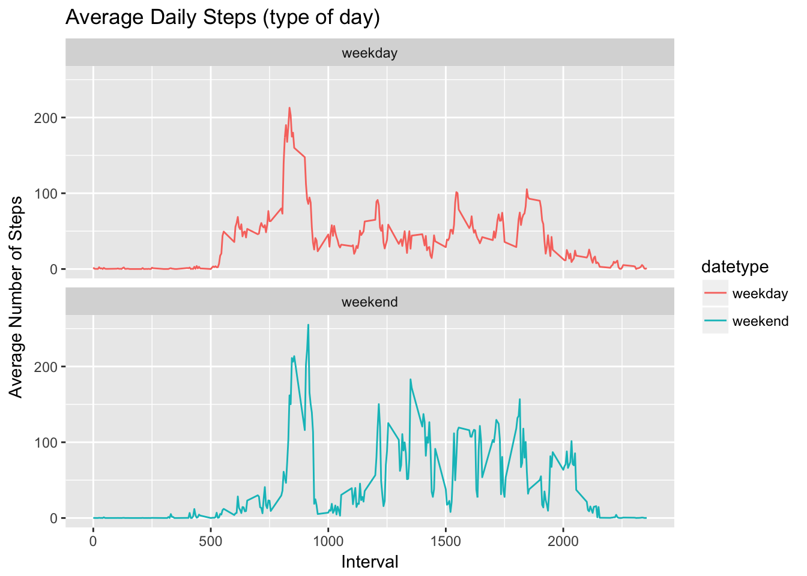

### Introduction

This project is part of the [Reproducible Research Course](https://www.coursera.org/learn/reproducible-research). The assignment makes use of data from a personal activity monitoring device. This device collects data at 5 minute intervals through out the day. The data consists of two months of data from an anonymous individual collected during the months of October and November, 2012 and include the number of steps taken in 5 minute intervals each day.

### 1. Code for reading in the dataset and/or processing the data


```r
if (!file.exists("activity.csv")) { 
  download.file(
    "https://d396qusza40orc.cloudfront.net/repdata%2Fdata%2Factivity.zip", 
    "activity.zip")
  unzip(zipfile="activity.zip")
}

activity <- read.csv("activity.csv")
activity$date <- as.Date(activity$date, "%Y-%m-%d")
stepsPerDate <- aggregate(steps ~ date, data = activity, FUN = sum, na.rm = TRUE)

summary(activity)
```

```
##      steps             date               interval     
##  Min.   :  0.00   Min.   :2012-10-01   Min.   :   0.0  
##  1st Qu.:  0.00   1st Qu.:2012-10-16   1st Qu.: 588.8  
##  Median :  0.00   Median :2012-10-31   Median :1177.5  
##  Mean   : 37.38   Mean   :2012-10-31   Mean   :1177.5  
##  3rd Qu.: 12.00   3rd Qu.:2012-11-15   3rd Qu.:1766.2  
##  Max.   :806.00   Max.   :2012-11-30   Max.   :2355.0  
##  NA's   :2304
```

### 2. Histogram of the total number of steps taken each day


```r
hist(stepsPerDate$steps, 
    main="Total Number Steps per Day", 
    xlab="Number of Steps", ylab = "Interval Frequency Count",
    col="deepskyblue", breaks = seq(0,25000, by=1000))
```



### 3. Mean and median number of steps taken each day

Mean number of steps taken each day

```r
mean(stepsPerDate$steps)
```

```
## [1] 10766.19
```

Median number of steps taken each day

```r
median(stepsPerDate$steps)
```

```
## [1] 10765
```

### 4. Time series plot of the average number of steps taken

Time series plot of the average number of steps taken in each interval

```r
stepsPerInterval <- aggregate(steps ~ interval, data = activity, 
                              FUN = mean, na.rm = TRUE)
plot(x = stepsPerInterval$interval, y = stepsPerInterval$steps, 
    type = "l", col = "deepskyblue", main = "Average Number of Steps over Time", 
    xlab = "5-minute Intervals", ylab = "Average Steps Taken")
```


    
### 5. The 5-minute interval that, on average, contains the maximum number of steps

Finding the maximum number of steps through all the intervals

```r
stepsPerInterval$interval[which.max(stepsPerInterval$steps)]
```

```
## [1] 835
```

## 6. Code to describe and show a strategy for imputing missing data

The total number of rows with `NA`s

```r
intNA<- is.na(activity$steps)
sum(intNA)
```

```
## [1] 2304
```

Take the mean interval value as missing data replacement, and copy the data into a new variable.

```r
meanInterval <- tapply(activity$steps, activity$interval, mean, na.rm = TRUE)
activityNaImp <- activity
activityNaImp$steps[intNA] <- meanInterval[as.character(activity$interval[intNA])]
```

### 7. Histogram of the total number of steps taken each day after missing values are imputed


```r
stepsPerDateNAImp <- aggregate(steps ~ date, data = activityNaImp, 
                               FUN = sum, na.rm = TRUE)
hist(stepsPerDateNAImp$steps, 
    main="Total Number Steps per Day", 
    xlab="Number of Steps", ylab = "Interval Frequency Count",
    col="sienna2", breaks = seq(0,25000, by=1000))
```



Mean and Median number of steps taken each day of the imputed data

```r
summary(stepsPerDateNAImp$steps)
```

```
##    Min. 1st Qu.  Median    Mean 3rd Qu.    Max. 
##      41    9819   10766   10766   12811   21194
```

Mean and Median number of steps taken each day of the original activity data for comparison

```r
summary(stepsPerDate$steps)
```

```
##    Min. 1st Qu.  Median    Mean 3rd Qu.    Max. 
##      41    8841   10765   10766   13294   21194
```

Qualtile values have been significantly modified by imputing the data using the mean interval strategy. 

### 8. Panel plot comparing the average number of steps taken per 5-minute interval across weekdays and weekends

Creating a new factor variable in the dataset with two levels – “weekday” and “weekend” by using the the dataset with the filled-in missing values. 

```r
activityNaImp$datetype <- sapply(activityNaImp$date, function(x) {
        if (weekdays(x, abbr = TRUE) == "Sat" | weekdays(x) =="Sun" )
          {y <- "weekend"} 
        else 
          {y <- "weekday"}
        y })
```

Panel plot containing a time series plot of the 5-minute interval and the average number of steps taken, averaged across all weekday days or weekend days. 


```r
require(ggplot2)
ggplot(aggregate(steps~interval + datetype, activityNaImp, mean, na.rm = TRUE), 
       aes(x = interval , y = steps, color = datetype)) +
       geom_line() +
       labs(title = "Average Daily Steps (type of day)", 
            x = "Interval", y = "Average Number of Steps") +
       facet_wrap(~ datetype, ncol = 1, nrow = 2)
```



